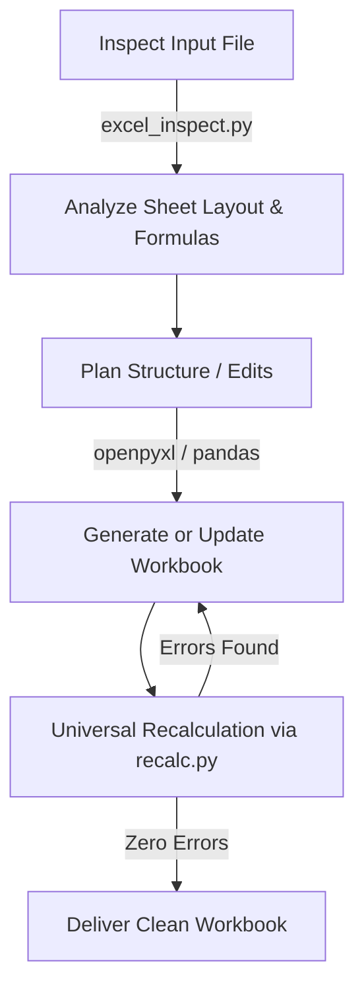

# XLSX Creation, Editing, Analysis, and Verification

Professional workflows for creating, inspecting, styling, and safely modifying Microsoft Excel (`.xlsx`, `.xlsm`) and tabular (`.csv`, `.tsv`) spreadsheets with zero formula errors, OpenXML integrity, and universal formula recalculation (supporting native MS Excel and LibreOffice).

---

## Environment Setup

This skill uses Python with `openpyxl`, `pandas`, and `pywin32`. All scripts declare dependencies using PEP 723 metadata (`# /// script ...`) and execute in isolated virtual environments.

> [!IMPORTANT]
> **Never use global pip.** Do not run `pip install` into the system environment. Always execute scripts through `uv run`.

### Execution Commands:

1. **With `uv` (Standard):**
   ```bash
   uv run scripts/excel_inspect.py <path_to_file> [--mode summary|preview|formulas]
   uv run scripts/recalc.py <path_to_file> [--timeout 30] [--engine auto|excel|libreoffice]
   ```

2. **Fallback with dedicated `.venv`:**
   If running in an environment where `uv` is not present, create a local `.venv` within the skill directory:
   ```bash
   # Windows
   python -m venv .venv
   .\.venv\Scripts\pip install openpyxl pandas pywin32
   .\.venv\Scripts\python scripts/recalc.py <path_to_file>

   # Linux/macOS
   python -m venv .venv
   ./.venv/bin/pip install openpyxl pandas
   ./.venv/bin/python scripts/recalc.py <path_to_file>
   ```

---

## Tool Selection Matrix

| Task | Approach | Command / Library |
| :--- | :--- | :--- |
| **Quick look & tabular preview** | Built-in inspector | `uv run scripts/excel_inspect.py file.xlsx --mode preview` |
| **Inspect sheets & formula count** | Built-in inspector | `uv run scripts/excel_inspect.py file.xlsx --mode summary` |
| **Export to JSON (Records for LLM / RAG)** | Built-in inspector | `uv run scripts/excel_inspect.py file.xlsx --format json [--out data.json]` |
| **Export to JSON-Grid (Coordinates & formulas for edits)** | Built-in inspector | `uv run scripts/excel_inspect.py file.xlsx --format json-grid [--out grid.json]` |
| **Export to HTML (Merged cells colspan/rowspan for LLM/UI)** | Built-in inspector | `uv run scripts/excel_inspect.py file.xlsx --format html [--out table.html]` |
| **Create new spreadsheet with formulas/formatting** | Python script | `openpyxl` (see styling guidelines below) |
| **Bulk data ingestion or export** | Python script | `pandas` (`read_excel`, `to_excel`, `read_csv`) |
| **Read existing model (formulas + cached values)** | Python script | Two `load_workbook` passes (`data_only=False` & `data_only=True`) |
| **Recalculate & verify zero formula errors** | Universal recalculator | `uv run scripts/recalc.py output.xlsx` |

---

## Recommended Workflow



### 1. Inspect Before Editing
Before making changes to an existing workbook, inspect its structure and coordinates:
```bash
# 1. Inspect sheets, row/col counts, and formula presence
uv run scripts/excel_inspect.py document.xlsx --mode summary

# 2. View markdown grid with coordinate headers [A], [B] and row numbers
uv run scripts/excel_inspect.py document.xlsx --mode preview --sheet "Sheet1" --max-rows 20

# 3. List existing formulas
uv run scripts/excel_inspect.py document.xlsx --mode formulas
```

### 1.1 Export for LLM Consumption (JSON & HTML)
To feed spreadsheet contents into LLM prompts or UI views in structured formats:

```bash
# Export tabular data as clean JSON records (ideal for analytics, search, RAG):
uv run scripts/excel_inspect.py model.xlsx --format json [--out data.json] [--dense]

# Export coordinate map with values and raw formulas (ideal for planning formula edits):
uv run scripts/excel_inspect.py model.xlsx --format json-grid [--out grid.json]

# Export semantic HTML table with merged cell support (colspan/rowspan) and styling:
uv run scripts/excel_inspect.py model.xlsx --format html [--out table.html] [--all-sheets]
```

### 2. Creating or Modifying with `openpyxl`
Write a Python script that uses `openpyxl` to construct or update the file:
- Follow styling guidelines from the domain rules in [excel-integrity.md](../../rules/excel-integrity.md).
- Write dynamic formulas (e.g., `sheet['B10'] = '=SUM(B2:B9)'`), never static hardcoded totals.
- If editing an existing file, match its existing fonts, borders, and colors exactly.

### 3. Recalculate and Verify (Mandatory for Formulas)
`openpyxl` writes formula strings without calculating or caching cell values. To ensure formulas evaluate cleanly and external viewers (like `pandas` or Excel online) see calculated results, run `recalc.py`:

```bash
uv run scripts/recalc.py output.xlsx
```

#### Recalculator Engines:
The universal recalculator automatically chooses the best available engine:
- **`ms-excel`**: Uses native Microsoft Excel via Windows COM (`win32com.client`). Full support for 100% of Excel features, including dynamic arrays (`XLOOKUP`, `UNIQUE`, `FILTER`, `LET`).
- **`libreoffice`**: Cross-platform headless calculation using LibreOffice Calc.
- You can force a specific engine:
  ```bash
  uv run scripts/recalc.py output.xlsx --engine excel
  uv run scripts/recalc.py output.xlsx --engine libreoffice
  ```

#### Recalculation Output:
The script outputs JSON:
```json
{
  "status": "success",
  "engine": "ms-excel",
  "total_formulas": 18,
  "total_errors": 0,
  "error_summary": {}
}
```
If `status` is `"errors_found"`, review the cell coordinates listed in `error_summary` (e.g., `#VALUE!`, `#REF!`, `#NAME?`), fix the formulas in your generation script, and rerun.

---

## Formula Guidelines & Compatibility

1. **Universal Functions (Excel 2007 era):**
   `SUM`, `SUMIFS`, `AVERAGE`, `COUNTIF`, `COUNTIFS`, `INDEX`, `MATCH`, `IF`, `IFERROR`, `SUMPRODUCT`.
   These evaluate without prefixes across all versions and engines.

2. **Post-2007 Functions (`_xlfn.` prefix required in openpyxl):**
   `openpyxl` writes raw XML tags. Functions added after Excel 2007 must be prefixed:
   - `_xlfn.TEXTJOIN(...)`
   - `_xlfn.CONCAT(...)`
   - `_xlfn.IFS(...)`
   - `_xlfn.SWITCH(...)`
   - `_xlfn.MAXIFS(...)`
   - `_xlfn.MINIFS(...)`
   *Omitting `_xlfn.` will cause `#NAME?` errors in Excel.*

3. **Spilling Array Functions:**
   `XLOOKUP`, `SORT`, `FILTER`, `UNIQUE`, `SEQUENCE` require dynamic array metadata. When targeting LibreOffice or general legacy compatibility, use `INDEX`/`MATCH` instead of `XLOOKUP`, and sort/filter data in Python prior to insertion.

---

## Financial Model Design Standards

When creating financial models or executive tables, adhere to standard conventions:

- **Typography:** Single professional font throughout (e.g. `Arial`, `Calibri`, or `Segoe UI`). Title in 14–16pt bold, table headers 10–11pt bold, data 10pt regular.
- **Color Coding:**
  - **Blue (`0,0,255`):** Inputs, manual scenario drivers, user-editable parameters.
  - **Black (`0,0,0`):** Formulas and calculated logic.
  - **Green (`0,128,0`):** Links to other sheets within the workbook.
  - **Red (`255,0,0`):** Links to external workbooks.
  - **Soft Yellow fill (`#FFFFCC`):** High-priority input cells for user entry.
- **Number Formats:**
  - Currency: `$#,##0` or `$#,##0;($#,##0);"-"` (units clearly stated in headers, e.g. `Revenue ($K)`).
  - Percentages: Formatted as `0.0%`, stored as decimal fractions (`0.15` for 15.0%).
  - Multiples: `0.0x`.
  - Years: Plain text strings (`"2025"`), never numbers formatted with thousand separators.
- **Layout:** Auto-fit column widths with 2–3 characters padding; freeze panes on header rows; ensure grid lines remain enabled (`ws.views.sheetView[0].showGridLines = True`).

---

## openpyxl Gotchas

- **Reading a model takes two passes:** `data_only=True` returns cached values (formulas stripped); `data_only=False` returns formula strings (values are `None`).
- **`data_only=True` is destructive on save:** Never save a workbook loaded with `data_only=True`; it overwrites all formula strings with static values permanently.
- **Merged cells:** Always assign values and styles to the top-left cell. All other cells in the merge range are read-only `MergedCell` proxies.
- **Preserving macros:** Always pass `keep_vba=True` when opening `.xlsm` files to keep VBA macros intact.
- **Spaces in sheet names:** Always quote sheet names containing spaces or special characters in formula references: `='Assumptions Inputs'!$B$5`.
- **External links corrupted on save:** `openpyxl.save()` does not safely preserve OpenXML `/xl/externalLinks/externalLink1.xml` cached values. Saving workbooks with external links in `openpyxl` triggers Excel repair alerts (`[RecoveredExternalLink1]`). Handle workbooks with external references via MS Excel COM or separate data pipelines.

---

## Domain Integrity Rules

Review the mandatory plugin rules in [excel-integrity.md](../../rules/excel-integrity.md) for detailed requirements regarding automatic `.bak` backups, external link protection, and error prevention.
