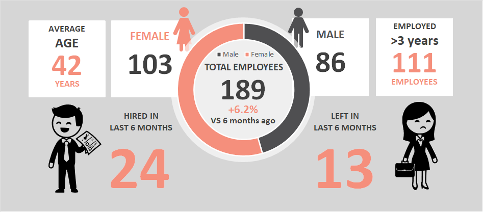
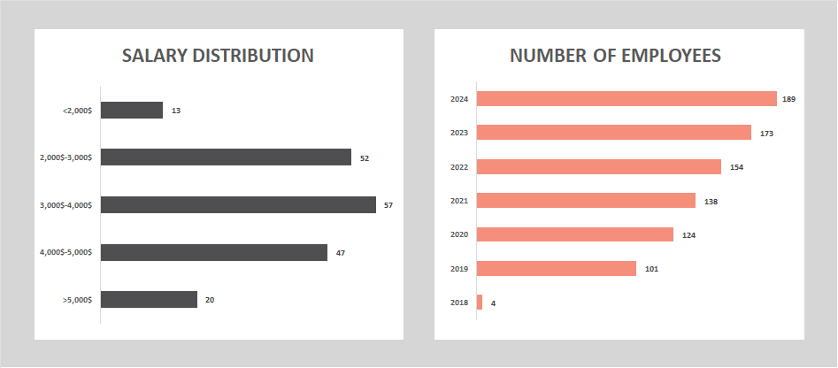
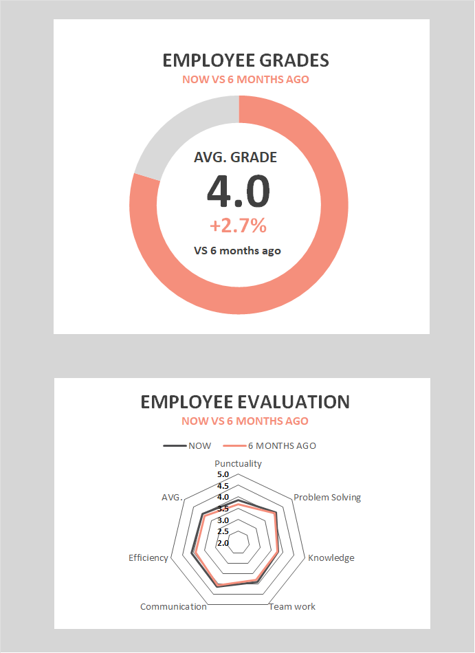

November 2024

Prepared By

**Samantha Richardson**HR Manager

[555-1234-5678]
[samantha.richardson@company.com]

semiannual report Report

Achievements

Over the past six months, we have successfully increased our workforce by +6.2%, reflecting our commitment to growth and talent acquisition, with 24 new hires joining our team. Our gender diversity continues to improve, with females now making up 54% of our Development department. Our focused training and development programs have contributed to a notable increase in overall employee efficiency and problem-solving skills.

Headcount

Our total workforce now stands at 189 employees, with a balanced gender distribution of 103 females and 86 males. Over the past six months, we have successfully onboarded 24 new employees, while 13 individuals have departed. Notably, 111 employees have been with us for more than three years, demonstrating strong employee retention. This period also saw a +6.2% increase in our total headcount compared to six months ago, highlighting our steady growth and commitment to expanding our talent pool.

Recruitment

The recruitment drive this period has been highly successful, bringing in a diverse array of talents that align perfectly with our organizational goals. The focus has been on not just filling positions but finding candidates who demonstrate strong potential for growth within the company.

|  |  |  |  |  |
| --- | --- | --- | --- | --- |
| **Name** | **Department** | **Gender** | **Hiring date** | **Role** |
| Employee No.219 | SECURITY | F | 5/24/2023 | Security Officer |
| Employee No.220 | SECURITY | F | 6/4/2023 | Security Analyst |
| Employee No.221 | SALES | F | 6/6/2023 | Sales Representative |
| Employee No.222 | QC | F | 6/8/2023 | Quality Control Specialist |
| Employee No.223 | QC | M | 6/14/2023 | Quality Assurance Engineer |
| Employee No.224 | DEVELOPMENT | M | 6/15/2023 | Software Developer |
| Employee No.225 | DEVELOPMENT | F | 6/16/2023 | Front-End Developer |
| Employee No.226 | DEVELOPMENT | F | 6/19/2023 | Back-End Developer |
| Employee No.227 | SALES | M | 6/30/2023 | Sales Executive |
| Employee No.228 | SECURITY | F | 7/4/2023 | Security Consultant |
| Employee No.229 | SALES | M | 7/13/2023 | Sales Manager |
| Employee No.230 | SALES | F | 7/29/2023 | Sales Associate |
| Employee No.231 | SALES | M | 8/1/2023 | Sales Director |
| Employee No.232 | DEVELOPMENT | M | 8/16/2023 | Software Engineer |
| Employee No.233 | DEVELOPMENT | F | 9/4/2023 | Full-Stack Developer |
| Employee No.234 | SALES | F | 9/7/2023 | Sales Coordinator |
| Employee No.235 | DEVELOPMENT | M | 9/15/2023 | DevOps Engineer |
| Employee No.236 | SECURITY | M | 9/18/2023 | Security Manager |
| Employee No.237 | QC | F | 9/20/2023 | Quality Inspector |
| Employee No.238 | QC | F | 9/21/2023 | QC Analyst |
| Employee No.239 | SECURITY | F | 10/2/2023 | Security Specialist |
| Employee No.240 | DEVELOPMENT | F | 10/22/2023 | Data Scientist |
| Employee No.241 | SECURITY | F | 10/28/2023 | Security Engineer |
| Employee No.242 | QC | F | 11/5/2023 | Quality Control Technician |

Employee Growth
and Salary Distribution ANALYSIS

Over the past five years, our company has experienced a remarkable upward trend in employee growth, reflecting a consistent and strategic expansion of our workforce. This steady increase underscores our commitment to scaling operations and investing in human capital to drive innovation and productivity. Concurrently, the salary distribution chart highlights our balanced approach to compensation, ensuring fair and competitive remuneration across various roles and departments. Notably, as our team has grown, we’ve maintained equitable salary structures that attract top talent and encourage retention. This alignment between workforce growth and structured salary distribution demonstrates our dedication to fostering a motivated and well-compensated team, pivotal to our long-term success.

In the upcoming six months, we plan to continue our strategic hiring initiatives to support ongoing projects and anticipated expansions. Our goal is to increase our workforce by an additional 10%, focusing on key areas such as Development, Quality Control, and Sales. This growth will be accompanied by a thorough review of our current salary structures to ensure we remain competitive within the industry. We aim to implement slight salary adjustments to align with market trends and reward outstanding performance, thereby maintaining high levels of employee satisfaction and retention. These plans are essential to sustain our momentum and support our overarching business objectives.

Training

Over the last six months, our training program has effectively enhanced employee skills and productivity, with an increase in participation and positive feedback. The comprehensive approach to learning has equipped our workforce with advanced knowledge and practical tools, fostering an environment of continuous improvement.

|  |  |  |  |
| --- | --- | --- | --- |
| **Training**  **Program** | **Participants**  **Number** | **Faculty** | **Feedback Summary** |
| Advanced  Techniques | 25 | Dr. John Doe | Highly effective and engaging, participants reported a significant increase in their understanding. |
| Practical  Applications | 12 | Prof. Jane Smith | Well-organized and thorough, with practical applications that improved job performance immediately. |
| Interactive  Learning | 26 | Dr. Emily Davis | Very informative and interactive, participants appreciated the real-life case studies and hands-on practice. |
| Role  Relevance | 27 | Dr. Michael Brown | Excellent delivery and content, participants found the training highly relevant and useful. |
| Support  Materials | 28 | Prof. Laura White | Comprehensive and detailed, with excellent support materials that helped reinforce key concepts. |
| Insightful  Learning | 29 | Dr. Sarah Johnson | Engaging and insightful, with positive feedback on the clarity and depth of the material presented. |
| Skill  Application | 30 | Prof. William Lee | Informative and well-paced, participants felt more confident in applying the skills learned. |
| Practical  Applications | 31 | Dr. Patricia Wilson | Very thorough and practical, participants appreciated the focus on real-world applications. |
| Multimedia  Learning | 32 | Dr. Robert Clark | Highly beneficial and interactive, with excellent use of multimedia to enhance learning. |

PERIODIC EMPLOYEE EVALUATION

Over the past evaluation period, our employees have demonstrated commendable performance across various segments, reflecting the effectiveness of our training and development programs. The overall grades indicate significant improvements, with a general rise in the average employee grade by +2.7%. This progression is most noticeable in the segments of knowledge, teamwork, problem-solving abilities, communication, punctuality, and efficiency.

**Knowledge:** There has been a marked improvement in employees' technical and industry-specific knowledge. This is attributed to the targeted training programs and workshops conducted over the last six months.

**Teamwork:** Collaborative efforts have shown remarkable enhancement, with employees consistently performing well in team-based projects. The increase in team-building activities and cross-departmental projects has fostered a more cohesive working environment.

**Problem Solving:** Employees have exhibited better problem-solving skills, as seen in their ability to handle complex tasks with minimal supervision. This improvement aligns with our focus on scenario-based training and hands-on workshops.

**Communication:** Our team members have shown significant strides in their communication skills, leading to clearer and more effective exchanges within and across departments. This improvement has positively impacted overall productivity and team dynamics.

**Punctuality:** There has been a noticeable increase in punctuality, with employees consistently meeting deadlines and showing timeliness in their daily work. This enhanced punctuality reflects our efforts to instill a strong sense of responsibility and time management among our workforce.

**Efficiency:** The overall efficiency of our employees has improved, with tasks being completed more quickly and with greater accuracy. This rise in efficiency can be attributed to the streamlined processes and continuous improvement initiatives we've implemented.

**Analysis by Departments**

**Development:** The Development department shows the highest improvement in problem-solving skills, likely due to the technical challenges regularly faced by this team. Knowledge upgrades are also significant here, reflecting the department's engagement in continuous learning and innovation.

**Quality Control (QC):** The QC department's scores in attention to detail and adherence to standards are impressive. However, teamwork is slightly lower compared to other departments, indicating a potential area for improvement through enhanced team-building exercises.

**Sales:** Sales personnel have excelled in communication and customer engagement skills, which are critical for their roles. Knowledge and teamwork have also improved, though there is room for further enhancement in problem-solving techniques tailored to client interactions.

**Security:** The Security department has shown steady performance across all segments, with a notable emphasis on adherence to protocols and responsiveness. Continuous training on new security protocols has likely contributed to these consistent scores.

In summary, our employees have made significant strides in their professional growth, with overall positive trends across all evaluated segments. By focusing on targeted areas for each department, we can continue to drive improvements and foster a culture of excellence.

Recognition

Our company takes pride in acknowledging the hard work and dedication of our employees. Over the past six months, we have celebrated several key achievements and recognitions that highlight the exceptional contributions of our team.

|  |  |  |  |
| --- | --- | --- | --- |
| **Employee Name** | **Department** | **Recognition** | **Date** |
| John Smith | Development | Employee of the Month | May 2023 |
| Jane Doe | Sales | Top Sales Performer | June 2023 |
| Alex Johnson | Quality Control | Excellence in Quality Assurance | August 2023 |
| Emma Brown | Development | Innovation Award | September 2023 |
| Chris White | Security | Outstanding Service | September 2023 |
| Lisa Black | Development | Team Player Award | October 2023 |

HR Events

* May 2024 - Annual Company Retreat
* June 2024 - Diversity and Inclusion Training
* July 2024 - Leadership Development Program
* August 2024 - Mid-Year Performance Reviews
* September 2024 - Team Building Exercises
* October 2024 - Employee Appreciation Day

Concern Areas

* Employee Turnover: Addressing the departure of 13 employees in the last six months.
* Teamwork in QC: Enhancing team-building efforts for the Quality Control department.
* Training Participation: Increasing participation rates in training programs.

## Комментарии / Comments

- **[#0] Konstantin Ivanov** *(2026-09-11T13:41:00Z)*:
  > *К фрагменту:* "Over the past six months, we have successfully increased our workforce by +6.2%, reflecting our commitment to growth and talent acquisition, with 24 new hires joining our team. Our gender diversity continues to improve, with females now making up 54% of our Development department. Our focused training and development programs have contributed to a notable increase in overall employee efficiency and problem-solving skills."
  >
  > My Comment
