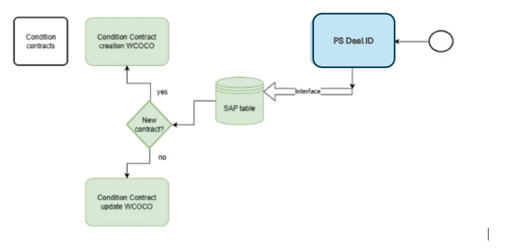
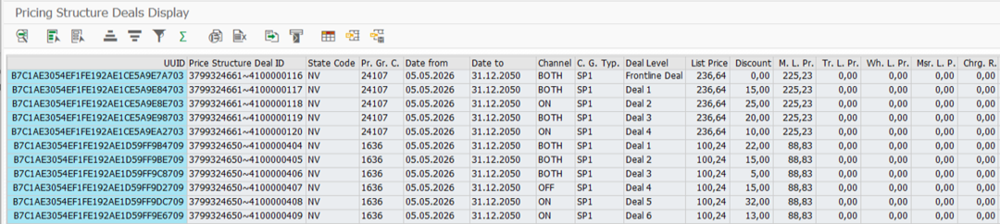
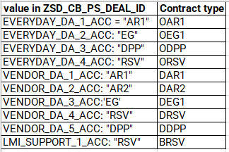
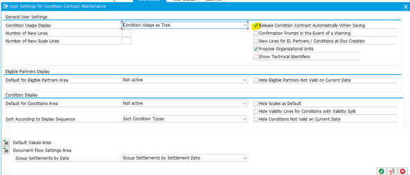

# CCB-108 Chargeback Condition Contract creation

|  |  |
| --- | --- |
| **BBG-E-VISTAAR-0043** | BBG-E-VISTAAR-0043 (updated) |
| **Type** | ENHANCEMENT |
| **Status** | IN PROGRESS |
| **Functional Owner** | [Mihailova, Olga](https://breakthrubev.atlassian.net/wiki/people/712020%3A3891d9a3-b190-45d3-a634-69841ecb935e?ref=confluence) |
| **Functional Stream** | VISTAAR |
| **Technical Owner** |  |
| **Approver BBG** |  |
| **Links to Business Process** |  |
| **Links to Functional Design** |  |

* [1 Change Log](https://breakthrubev.atlassian.net/wiki/spaces/BBGS4H/pages/1811843204/BBG-E-VISTAAR-0001%2BCreate%2BCustomer%2BGroup%2Bfield%2Bin%2BCustomer%2BMaster%2Bin%2BECC%2Band%2BS4#1-Change-Log)
* [2 Open topics](https://breakthrubev.atlassian.net/wiki/spaces/BBGS4H/pages/1811843204/BBG-E-VISTAAR-0001%2BCreate%2BCustomer%2BGroup%2Bfield%2Bin%2BCustomer%2BMaster%2Bin%2BECC%2Band%2BS4#2-Open-topics)
* [3 Requirement](https://breakthrubev.atlassian.net/wiki/spaces/BBGS4H/pages/1811843204/BBG-E-VISTAAR-0001%2BCreate%2BCustomer%2BGroup%2Bfield%2Bin%2BCustomer%2BMaster%2Bin%2BECC%2Band%2BS4#3-Requirement)
  + [3.1 Approval details](https://breakthrubev.atlassian.net/wiki/spaces/BBGS4H/pages/1811843204/BBG-E-VISTAAR-0001%2BCreate%2BCustomer%2BGroup%2Bfield%2Bin%2BCustomer%2BMaster%2Bin%2BECC%2Band%2BS4#3.1-Approval-details)
  + [3.2 Requirement overview](https://breakthrubev.atlassian.net/wiki/spaces/BBGS4H/pages/1811843204/BBG-E-VISTAAR-0001%2BCreate%2BCustomer%2BGroup%2Bfield%2Bin%2BCustomer%2BMaster%2Bin%2BECC%2Band%2BS4#3.2-Requirement-overview)
  + [3.3 Business requirement](https://breakthrubev.atlassian.net/wiki/spaces/BBGS4H/pages/1811843204/BBG-E-VISTAAR-0001%2BCreate%2BCustomer%2BGroup%2Bfield%2Bin%2BCustomer%2BMaster%2Bin%2BECC%2Band%2BS4#3.3-Business-requirement)
* [4 Detailed Functional Requirements](https://breakthrubev.atlassian.net/wiki/spaces/BBGS4H/pages/1811843204/BBG-E-VISTAAR-0001%2BCreate%2BCustomer%2BGroup%2Bfield%2Bin%2BCustomer%2BMaster%2Bin%2BECC%2Band%2BS4#4-Detailed-Functional-Requirements)
  + [4.1 Dependencies and constraints](https://breakthrubev.atlassian.net/wiki/spaces/BBGS4H/pages/1811843204/BBG-E-VISTAAR-0001%2BCreate%2BCustomer%2BGroup%2Bfield%2Bin%2BCustomer%2BMaster%2Bin%2BECC%2Band%2BS4#4.1-Dependencies-and-constraints)
  + [4.2 Requirement details](https://breakthrubev.atlassian.net/wiki/spaces/BBGS4H/pages/1811843204/BBG-E-VISTAAR-0001%2BCreate%2BCustomer%2BGroup%2Bfield%2Bin%2BCustomer%2BMaster%2Bin%2BECC%2Band%2BS4#4.2-Requirement-details)
  + [4.3 Integration](https://breakthrubev.atlassian.net/wiki/spaces/BBGS4H/pages/1811843204/BBG-E-VISTAAR-0001%2BCreate%2BCustomer%2BGroup%2Bfield%2Bin%2BCustomer%2BMaster%2Bin%2BECC%2Band%2BS4#4.3-Integration)
  + [4.4 Accesses](https://breakthrubev.atlassian.net/wiki/spaces/BBGS4H/pages/1811843204/BBG-E-VISTAAR-0001%2BCreate%2BCustomer%2BGroup%2Bfield%2Bin%2BCustomer%2BMaster%2Bin%2BECC%2Band%2BS4#4.4-Accesses)
* [5 Implementation Details](https://breakthrubev.atlassian.net/wiki/spaces/BBGS4H/pages/1811843204/BBG-E-VISTAAR-0001%2BCreate%2BCustomer%2BGroup%2Bfield%2Bin%2BCustomer%2BMaster%2Bin%2BECC%2Band%2BS4#5-Implementation-Details)
  + [5.1 Details](https://breakthrubev.atlassian.net/wiki/spaces/BBGS4H/pages/1811843204/BBG-E-VISTAAR-0001%2BCreate%2BCustomer%2BGroup%2Bfield%2Bin%2BCustomer%2BMaster%2Bin%2BECC%2Band%2BS4#5.1-Details)
  + [5.2 Developed objects list](https://breakthrubev.atlassian.net/wiki/spaces/BBGS4H/pages/1811843204/BBG-E-VISTAAR-0001%2BCreate%2BCustomer%2BGroup%2Bfield%2Bin%2BCustomer%2BMaster%2Bin%2BECC%2Band%2BS4#5.2-Developed-objects-list)
* [6 Unit Testing](https://breakthrubev.atlassian.net/wiki/spaces/BBGS4H/pages/1811843204/BBG-E-VISTAAR-0001%2BCreate%2BCustomer%2BGroup%2Bfield%2Bin%2BCustomer%2BMaster%2Bin%2BECC%2Band%2BS4#6-Unit-Testing)

# 0. Jira tickets

|  |  |  |  |
| --- | --- | --- | --- |
| **Date** | **Owner** | **Jira Link** | **Description** |
| March, 2nd, 2026 | [Mihailova, Olga](https://breakthrubev.atlassian.net/wiki/people/712020%3A3891d9a3-b190-45d3-a634-69841ecb935e?ref=confluence) | [[S4H-2629] [DEV] Chargebacks Condition Contract Creation - Jira](https://breakthrubev.atlassian.net/browse/S4H-2629) | Creation of Condition Contracts |
|  |  |  |  |

## 1 Change Log

|  |  |  |
| --- | --- | --- |
| **Version** | **Date** | **Comment** |
| [**Current Version**](https://breakthrubev.atlassian.net/wiki/pages/viewpage.action?pageId=2531983361) **(v. 16)** | **Sep 15, 2026 11:29** | [**Mihailova, Olga**](https://breakthrubev.atlassian.net/wiki/people/712020%3A3891d9a3-b190-45d3-a634-69841ecb935e) |
| [v. 15](https://breakthrubev.atlassian.net/wiki/pages/viewpage.action?pageId=2723971079&pageVersion=15) | Sep 10, 2026 07:53 | [Mihailova, Olga](https://breakthrubev.atlassian.net/wiki/people/712020%3A3891d9a3-b190-45d3-a634-69841ecb935e) |
| [v. 14](https://breakthrubev.atlassian.net/wiki/pages/viewpage.action?pageId=2709356553&pageVersion=14) | Sep 03, 2026 15:56 | [Mihailova, Olga](https://breakthrubev.atlassian.net/wiki/people/712020%3A3891d9a3-b190-45d3-a634-69841ecb935e) |
| [v. 13](https://breakthrubev.atlassian.net/wiki/pages/viewpage.action?pageId=2691104773&pageVersion=13) | Sep 03, 2026 15:54 | [Mihailova, Olga](https://breakthrubev.atlassian.net/wiki/people/712020%3A3891d9a3-b190-45d3-a634-69841ecb935e) |
| [v. 12](https://breakthrubev.atlassian.net/wiki/pages/viewpage.action?pageId=2691727362&pageVersion=12) | Sep 02, 2026 18:50 | [Khaustovich, Andrei](https://breakthrubev.atlassian.net/wiki/people/712020%3Aeaa01dc6-1a8e-4ae6-9564-110274f3cec2) |
| [v. 11](https://breakthrubev.atlassian.net/wiki/pages/viewpage.action?pageId=2687074306&pageVersion=11) | Aug 27, 2026 08:20 | [Mihailova, Olga](https://breakthrubev.atlassian.net/wiki/people/712020%3A3891d9a3-b190-45d3-a634-69841ecb935e) |
| [v. 10](https://breakthrubev.atlassian.net/wiki/pages/viewpage.action?pageId=2664103938&pageVersion=10) | Aug 26, 2026 08:44 | [Mihailova, Olga](https://breakthrubev.atlassian.net/wiki/people/712020%3A3891d9a3-b190-45d3-a634-69841ecb935e) |
| [v. 9](https://breakthrubev.atlassian.net/wiki/pages/viewpage.action?pageId=2658697226&pageVersion=9) | Aug 20, 2026 16:47 | [Mihailova, Olga](https://breakthrubev.atlassian.net/wiki/people/712020%3A3891d9a3-b190-45d3-a634-69841ecb935e) |
| [v. 8](https://breakthrubev.atlassian.net/wiki/pages/viewpage.action?pageId=2645786627&pageVersion=8) | Aug 11, 2026 15:18 | [Mihailova, Olga](https://breakthrubev.atlassian.net/wiki/people/712020%3A3891d9a3-b190-45d3-a634-69841ecb935e) |
| [v. 7](https://breakthrubev.atlassian.net/wiki/pages/viewpage.action?pageId=2616557569&pageVersion=7) | Jul 17, 2026 11:09 | [Mihailova, Olga](https://breakthrubev.atlassian.net/wiki/people/712020%3A3891d9a3-b190-45d3-a634-69841ecb935e) |
| [v. 6](https://breakthrubev.atlassian.net/wiki/pages/viewpage.action?pageId=2544271378&pageVersion=6) | Jul 15, 2026 12:19 | [Mihailova, Olga](https://breakthrubev.atlassian.net/wiki/people/712020%3A3891d9a3-b190-45d3-a634-69841ecb935e) |
| [v. 5](https://breakthrubev.atlassian.net/wiki/pages/viewpage.action?pageId=2539257860&pageVersion=5) | Jul 14, 2026 14:47 | [Mihailova, Olga](https://breakthrubev.atlassian.net/wiki/people/712020%3A3891d9a3-b190-45d3-a634-69841ecb935e) |
| [v. 4](https://breakthrubev.atlassian.net/wiki/pages/viewpage.action?pageId=2536865797&pageVersion=4) | Jul 14, 2026 11:25 | [Mihailova, Olga](https://breakthrubev.atlassian.net/wiki/people/712020%3A3891d9a3-b190-45d3-a634-69841ecb935e) |
| [v. 3](https://breakthrubev.atlassian.net/wiki/pages/viewpage.action?pageId=2535325728&pageVersion=3) | Jul 14, 2026 06:54 | [Mihailova, Olga](https://breakthrubev.atlassian.net/wiki/people/712020%3A3891d9a3-b190-45d3-a634-69841ecb935e) |
| [v. 2](https://breakthrubev.atlassian.net/wiki/pages/viewpage.action?pageId=2535292937&pageVersion=2) | Jul 14, 2026 06:28 | [Mihailova, Olga](https://breakthrubev.atlassian.net/wiki/people/712020%3A3891d9a3-b190-45d3-a634-69841ecb935e) |
| [v. 1](https://breakthrubev.atlassian.net/wiki/pages/viewpage.action?pageId=2535096330&pageVersion=1) | Jul 14, 2026 06:28 | [Mihailova, Olga](https://breakthrubev.atlassian.net/wiki/people/712020%3A3891d9a3-b190-45d3-a634-69841ecb935e)  Offline edits |

# 2 Open topics

# 3 Requirement

 Vistaar provides the information required for Chargeback Condition contract creation or update in a JSON file via the interface on a daily basis.

The SAP table ZSD\_CB\_PS\_DEA\_ID is used as the basis for contract creation. This table stores all PS Deal IDs received from Vistaar. It has the same structure as the JSON file

### 3.1 Approval details

|  |  |  |
| --- | --- | --- |
| **Approval Date** | **Who approved** | **Details** |
|  |  |  |

### 3.2 Requirement overview

 BBG has three types of chargebacks - Overall, Bank Contribution and Deal.

**Overall Chargebacks**

Condition contract types based on A/R codes:

* OAR1 Overall Chargeback AR1
* ODPP Overall Chargeback DPP
* OEG1 Overall Chargeback EG
* ORSV Overall Chargeback RSV

Chargeback conditions will be created at the Company Code and Product Pricing Group levels, independent of Distribution Channel (DC) and Premise.

Business Volume includes all billing documents except those with DC '02'. DC '05' applies only to MO and is excluded in other states.

Condition Type ZCBK is used.

Scales are not used; only the PS Deal ID with the Frontline Deal is considered

**Bank Contribution Chargebacks**

Condition contract type based on A/R codes:

* BRSV  Reference Bank Chargeback

Chargeback condition will be created at the Company Code and Product Pricing Group levels, independent of the Distribution Channel (DC) and Premise

Business Volume will include all billing documents except those with Distribution Channel (DC) '02'. Distribution Channel '05' will be included only for MO and excluded for all other states

Condition Type ZCBB is used

Scales are not in use; only the PS Deal ID with the Frontline Deal to be considered

**Deal Chargebacks**

Condition contract types based on A/R codes:

* DAR1  Deal Chargeback AR1
* DAR2  Deal Chargeback AR2
* DDPP  Deal Chargeback DPP
* DEG1  Deal Chargeback EG
* DRSV  Deal Chargeback RSV

Chargeback condition will be created at the Company Code and Product Pricing Group levels and Customer Price Groups (KONDA), independent of the Distribution Channel (DC) and Premise

|  |  |  |  |  |
| --- | --- | --- | --- | --- |
| **JSON file** | | | **SAP** |  |
| **CUSTOMER\_GROUP\_TYPE** | **CHANNEL** | **STATE\_CODE** | **DistrChannel** | **KONDA** |
| SP1 | OFF | ALL | 01 | 01 |
| SP1 | ON | ALL | 01 | 02 |
| SP1 | BOTH | ALL | 01 | 01 and 02 |
| MIL | N/A | ALL | 03 | 03 |
| TRANS | N/A | ALL | 04 | 04 |
| WHS | N/A | = 'PA' | 01 | 05 |

Business Volume will include all billing documents except those with Distribution Channel (DC) ’02’ and ‘05’

KONDA to be added in COPA document (table CE11000)

Scales are in use (PS Deal ID + Deal Levels)

### 3.3 Business requirement

The PS Deal ID with the Frontline Deal (without Customer Group Type in the JSON file) will be used for conditions creation including all Customer Price Groups (KONDA) in the contract

The contract validity period should be determined based on the Frontline Deal and must match the validity period agreed with the supplier. For that reason the PS Deal ID with the Frontline Deal should be processed first.

# 4 Detailed Functional Requirements

### 4.1 Dependencies and constraints

 Vistaar provides the information required for Chargeback Condition contract creation or update in a JSON file via the interface on a daily basis.

The SAP table ZSD\_CB\_PS\_DEA\_ID stores all PS Deal IDs received from Vistaar. It has the same structure as the JSON file

This table is used for the creation or modification of Condition Contracts.

### 4.2 Requirement details

**4.2.1 Create contract:**

The PS Deal ID associated with the Frontline Deal (without Customer Group Type in the JSON file) will be used to create condition contracts. Created contract will include all Customer Price Groups ('01', ‘02’, ‘03’, ‘04’, and ‘05’ for PA).

A new custom program **ZSD\_CB\_CONTR\_CREATE** and job are created for contract creation using **BAPI\_CONDITION\_CONTRACT\_CREATE**.

The program checks line items in table ZSD\_CB\_PS\_DEAL\_ID with the following selection criteria:

* DEAL\_LEVEL = 'Frontline Deal'
* PS\_DEAL\_STATUS = 'C'
* CB\_CONTRACT\_STATUS is either blank or equal to 'E'

The selected records are then compared with the existing condition contracts.

A separate condition contract shall be created for each unique combination of Chargeback type, Company code and Supplier. If a condition contract already exists for the same combination of Chargeback Type, Company Code, and Supplier, proceed with the update logic described in Section 4.2.2.

If no condition contract exists for the combination, the system shall create one or more new condition contracts based on the Chargeback Type, A/R Code, Company Code, and Supplier, even if there is only a single line item in ZSD\_CB\_PS\_DEAL\_ID for the Product Pricing Group.

To determine how many contracts must be created, the program shall evaluate all A/R account fields whose value is not 'null'. A separate condition contract shall be created for each populated A/R account code.

Up to date mapping is being finalized in this file:
[https://epam-my.sharepoint.com/:x:/r/personal/piotr\_kozlowski1\_epam\_com/\_layouts/15/Doc.aspx?sourcedoc=%7B6045DE15-1A95-43FB-9488-62762D78CE6B%7D&file=Contract%20creation%20mappings.xlsx&action=default&mobileredirect=true](https://epam-my.sharepoint.com/%3Ax%3A/r/personal/piotr_kozlowski1_epam_com/_layouts/15/Doc.aspx?sourcedoc=%7B6045DE15-1A95-43FB-9488-62762D78CE6B%7D&file=Contract%20creation%20mappings.xlsx&action=default&mobileredirect=true)

***Basic data (structure KOMWCOCOH):***

|  |  |  |  |  |  |  |  |
| --- | --- | --- | --- | --- | --- | --- | --- |
| **Field** | **Type** | **Length** | **Dec** | **Description** | **Mapping** | **Example** | **Comments** |
| WCB\_COCO\_NUM | CHAR | 10 | 0 | Condition Contract | Internal numbering | 1000025 |  |
| WCB\_CONTRACT\_TYPE | CHAR | 4 | 0 | Condition Contract Type | Mapping to be used:   | DAR1 | Assumptions applied:   * Vendor\_DA is a deal chargeback type, * EVERYDAY\_DA is an overall chargeback type, and * LMI\_SUPPORT is a contribution   A separate condition contract shall be created for each unique combination of Chargeback type, Company code and Supplier.  To determine how many contracts must be created, the program shall evaluate all A/R account fields whose value is not 'null'. A separate condition contract shall be created for each populated A/R account code. |
| WCB\_VEND\_OWNER | CHAR | 10 | 0 | Supplier as Partner of a Condition Contract | Check  ZSD\_CB\_PS\_DEA\_ID-PRICING\_GROUP\_CODE and ZSD\_CB\_PS\_DEA\_ID-STATE\_CODE go to the table KOTG971-REGIO and KOTG971-ZZPRDGRP with the same value and find KOTG971-MATNR --> go to the table MARA-MATNR find MARA-PRDHA  --> Supplier code = MARA-PRDHA (initial 6 char) | 300123 | One contract to be created for one Supplier in each Company Code |
| WCB\_CREATED\_BY | CHAR | 12 | 0 | Condition Contract Created By | User name | SAP\_SYSTEM | to be defined automatically by system |
| WCB\_CREATED\_ON | DATS | 8 | 0 | Date of Condition Contract Creation | Entry date | 2/25/2026 | to be defined automatically by system |
| WCB\_REC\_TIME | TIMS | 6 | 0 | Time of Condition Contract Creation | Time of entry | 10:58:25 AM | to be defined automatically by system |
| WCB\_GUID | RAW | 16 | 0 | Condition Contract GUID | GUID | 005056AED8E51FE184CC494B9D6C3F19 | to be defined automatically by system |
| WCB\_DATE\_FROM | DATS | 8 | 0 | Valid From | Check ZSD\_CB\_PS\_DEA\_ID-START\_DATE - if year is 2026, start date should be ‘9/1/2026’ in PRD and ‘5/1/2026’ in QAS, for all another years start date to be ‘1/1/YYYY’ | 1/1/2021 |  |
| WCB\_DATE\_TO | DATS | 8 | 0 | Valid To | Default date 12/31/2050 | 12/31/2050 |  |
| SYSTZONLO | CHAR | 6 | 0 | Time Zone | Time zone | EST | to be defined automatically by system |
| WCB\_CC\_CURR | CUKY | 5 | 0 | Currency of Condition Contract | Default value = 'USD' | USD |  |
| WCB\_CONTRACT\_CATEGORY | CHAR | 2 | 0 | Condition Contract Category | Default value = 'Z1' (new customizing required) | Z1 | Purchasing chargeback |
| WCB\_CREATED\_ON\_TIMESTAMP | DEC | 15 | 0 | UTC Time Stamp of Condition Contract Creation | System date/time |  | to be defined automatically by system |
| WCB\_CHANGED\_ON\_TIMESTAMP | DEC | 15 | 0 | UTC Time Stamp of Last Condition Contract Change | Not relevant for contract creation |  | to be defined automatically by system |
| WCB\_OWNER\_TYPE | CHAR | 2 | 0 | Type of Business Partner for Condition Contract | Default value = 'V' | V |  |
|  |  |  |  |  |  |  |  |

Mapping for contract types:

|  |  |
| --- | --- |
| value in ZSD\_CB\_PS\_DEAL\_ID | Contract type |
| EVERYDAY\_DA\_1\_ACC = "AR1" | OAR1 |
| EVERYDAY\_DA\_2\_ACC: "EG" | OEG1 |
| EVERYDAY\_DA\_3\_ACC: "DPP" | ODPP |
| EVERYDAY\_DA\_4\_ACC: "RSV" | ORSV |
| VENDOR\_DA\_1\_ACC: "AR1" | DAR1 |
| VENDOR\_DA\_2\_ACC: "AR2" | DAR2 |
| VENDOR\_DA\_3\_ACC:'EG' | DEG1 |
| VENDOR\_DA\_4\_ACC: "RSV" | DRSV |
| VENDOR\_DA\_5\_ACC: "DPP" | DDPP |
| LMI\_SUPPORT\_1\_ACC: "RSV" | BRSV |

***Responsibility area (structure KOMWCOCOH):***

|  |  |  |  |  |  |  |  |
| --- | --- | --- | --- | --- | --- | --- | --- |
| BUKRS | CHAR | 4 | 0 | Company Code | Check ZSD\_CB\_PS\_DEA\_ID-STATE\_CODE go to the table ZSD\_ORG\_STR\_VST-STATE\_CODE and find list of Company Codes ZSD\_ORG\_STR\_VST-BUKRS | RCL1 | Separate contract to be created for each Company Code |

***System status (structure CRM\_JESTD) :***

|  |  |  |  |  |  |  |  |
| --- | --- | --- | --- | --- | --- | --- | --- |
| STAT | CHAR | 5 | 0 | Object Status | Contract status | ICC02 (Released) | Settings for technical user to be updated to have correct status automatically - ICC02 Released:   |

***Business Volume Selection Criteria (structure WB2\_S\_BUSVOLBASE\_MAINT):***

|  |  |  |  |  |  |  |  |
| --- | --- | --- | --- | --- | --- | --- | --- |
| WB2\_BVB\_FIELDCOMB | CHAR | 4 | 0 | Field Combination for Business Volume Selection | Default value = ‘0002’ | 0002 | Supplier |
| LIFNR | CHAR | 10 | 0 | Account Number of Supplier | Copy from KOMWCOCOH-WCB\_VEND\_OWNER | 300123 | The same supplier as in the header |
| WCB\_BVB\_INCL\_EXCL | CHAR | 1 | 0 | Status Including / Excluding | Default value = 'I' | I | Inclusive |
| WB2\_S\_BUSVOLBASE\_MAINT-VALID-FROM | DATS | 8 | 0 | Valid From | To be the same as in WCB\_DATE\_FROM:  Check ZSD\_CB\_PS\_DEA\_ID-START\_DATE - if year is 2026, start date should be ‘9/1/2026’ in PRD and ‘5/1/2026’ in QAS, for all another years start date to be ‘1/1/YYYY’ | 5/1/2026 |  |
| WB2\_S\_BUSVOLBASE\_MAINT-VALID\_TO | DATS | 8 | 0 | Valid To | Set the value to 12/31/YYYY, where YYYY is the same year as the value in MAINT-VALID-FROM | 12/31/2026 |  |
| WB2\_BVB\_FIELDCOMB | CHAR | 4 | 0 | Field Combination for Business Volume Selection | Default value = ‘0005’ | 0005 | Company Code |
| BUKRS | CHAR | 10 | 0 | Company Code | Copy from BUKRS | RCL1 | The same CompCode as in the header |
| WCB\_BVB\_INCL\_EXCL | CHAR | 1 | 0 | Status Including / Excluding | Default value = 'I' | I | Inclusive |
| WB2\_BVB\_FIELDCOMB | CHAR | 4 | 0 | Field Combination for Business Volume Selection | Default value = ‘0039’ | 0039 | Distribution Channel |
| WCB\_BVB\_INCL\_EXCL | CHAR | 1 | 0 | Status Including / Excluding | Default value = 'E' | E | Exclusive |
| VTWEG | CHAR | 2 | 0 | Distribution Channel | Default Value = ‘02’ | ‘02’ |  |
| WB2\_BVB\_FIELDCOMB | CHAR | 4 | 0 | Field Combination for Business Volume Selection | Default value = ‘0039’ | 0039 | Distribution Channel |
| WCB\_BVB\_INCL\_EXCL | CHAR | 1 | 0 | Status Including / Excluding | Default value = 'E' | E | Exclusive |
| VTWEG | CHAR | 2 | 0 | Distribution Channel | Default Value = ‘05’ | ‘05’ | If contract type <> DXXX and state <MO> |

***Settlement Data (structure KOMWCOCOH):***

|  |  |  |  |  |  |  |  |
| --- | --- | --- | --- | --- | --- | --- | --- |
| WB2\_SETTLEMENT\_TYPE\_VENDOR | CHAR | 1 | 0 | Settlement Type Supplier | Default value = '1' | 1 | As Accounts Receivable |
| WB2\_AMOUNT\_FIELDS\_GROUP | CHAR | 4 | 0 | Amount Fields Group | Default value = ‘0S01’ | 0S01 |  |
| COCO\_DET\_REL\_CONTR | CHAR | 1 | 0 | Relevant to Contract Determination | Default value = ' ' | Empty | From Customizing |

***Settlement Calendar (structure WB2\_S\_SETTL\_CAL\_MAINT):***

By default, three types of settlement calendars are to be created (three line items) in the contract.

|  |  |  |  |  |  |  |  |
| --- | --- | --- | --- | --- | --- | --- | --- |
| WB2\_SETTLEMENT\_DATE | DATS | 8 | 0 | Rebates: Settlement Date | ZSD\_CB\_PS\_DEA\_ID-START\_DATE + 1 day | 1/01/2026 | As Accounts Receivable |
| WB2\_SETTLEMENT\_DATE\_TYPE | CHAR | 1 | 0 | Rebates: Settlement Date Type | Default value = '3' | 3 | Delta accruals (daily) |
| WB2\_SETTL\_DATE\_USAGE | CHAR | 1 | 0 | Settlement Date Usage | Default value = '3' | 3 | Unplanned Settlement |

|  |  |  |  |  |  |  |  |
| --- | --- | --- | --- | --- | --- | --- | --- |
| WB2\_SETTLEMENT\_DATE | DATS | 8 | 0 | Rebates: Settlement Date | The last day of the contract's first month (WCB\_DATE\_FROM) | 1/31/2026 | As Accounts Receivable |
| WB2\_SETTLEMENT\_DATE\_TYPE | CHAR | 1 | 0 | Rebates: Settlement Date Type | Default value = '1' | 1 | Partial Settlement (Monthly) |
| WB2\_SETTL\_DATE\_USAGE | CHAR | 1 | 0 | Settlement Date Usage | Default value = '3' | 3 | Unplanned Settlement |

|  |  |  |  |  |  |  |  |
| --- | --- | --- | --- | --- | --- | --- | --- |
| WB2\_SETTLEMENT\_DATE | DATS | 8 | 0 | Rebates: Settlement Date | The last day of the contract's first year (WCB\_DATE\_FROM) | 12/31/2026 | As Accounts Receivable |
| WB2\_SETTLEMENT\_DATE\_TYPE | CHAR | 1 | 0 | Rebates: Settlement Date Type | Default value = ' ' | Empty | Final Settlement (Yearly) |
| WB2\_SETTL\_DATE\_USAGE | CHAR | 1 | 0 | Settlement Date Usage | Default value = ' ' | Empty | Standard |

***Conditions***

***Overall Chargebacks and Bank Contribution Chargebacks***

Only PS Deal ID where ZSD\_CB\_PS\_DEAL\_ID-DEAL\_LEVEL = 'Frontline Deal' to be used. Scales are not in use.

The rate will be calculated at the level of

* Company Code / Product Price Group with Net Value as the scale (table A858)

**or**

|  |  |  |  |
| --- | --- | --- | --- |
| Description | Field | Source | Base Scale |
| Condition type | KSCHA | Default value | For contract types OXXX condition type ‘ZCBK’ to be used, but contract BRSV it should be ‘ZCBB’ |
| Company Code | BUKRS | copy from Contract header | PRM1 |
| Product Pricing Group | PRICING\_GROUP\_CODE | ZSD\_CB\_PS\_DEA\_ID-PRICING\_GROUP\_CODE | 10522 |
| PS Deal ID | ZSD\_PS\_DEAL\_ID | ZSD\_CB\_PS\_DEA\_ID-PS\_DEAL\_ID | 333~4444 |
| Customer Group | ZZCUST\_GRP | To be copied from Sales Deal ID | FL-00007 |
| Calculation type | KRECH | Default value | C |
| Valid from | DATE\_FROM | ZSD\_CB\_PS\_DEA\_ID-START\_DATE | 1/1/2026 |
| Valid to | DATE\_TO | ZSD\_CB\_PS\_DEA\_ID-END\_DATE | 12/31/2026 |
| Condition rate | KBETR | Depends on contract type ZSD\_CB\_PS\_DEA\_ID- EVERYDAY\_DA\_1/EVERYDAY\_DA\_2/EVERYDAY\_DA\_3/EVERYDAY\_DA\_4/LMI\_SUPPORT\_1  If value = 0.00, ignore this item and condition line item shouldn’t be created | 6.00 |
| Condition currency | KONWA | Default value | USD |
| Pricing Unit | KPEIN | Default value | 1 |
| Unit of Measure | KMEIN | Default value | CSE |
| Scale type | STFKZ | Default value | B |
| Condition Record number | KNUMH | created automatically by SAP | 82034581 |
| Condition contract | COCO\_NUM\_KG | copy from Contract header automatically | 1000375 |

**Deal Chargebacks**

Starting from PS Deal ID where ZSD\_CB\_PS\_DEAL\_ID-DEAL\_LEVEL = 'Frontline Deal', all Deal Level to be used. Scales are in use.

In case if PS Deal ID with ZSD\_CB\_PS\_DEAL\_ID-DEAL\_LEVEL = ‘Frontline Deal' five condition line items to be created for all KONDA values (’01', ‘02, ‘03’, ‘04’, ‘05’ - for state = 'PA’).

If PS Deal ID with ZSD\_CB\_PS\_DEAL\_ID-DEAL\_LEVEL is not ‘Frontline Deal’, create condition line items based on mapping ZSD\_CB\_PS\_DEAL\_ID-CUSTOMER\_GROUP\_TYPE and ZSD\_CB\_PS\_DEAL\_ID-CHANNEL from the table below:

|  |  |  |  |  |
| --- | --- | --- | --- | --- |
| **JSON file** | | | **SAP** |  |
| **CUSTOMER\_GROUP\_TYPE** | **CHANNEL** | **STATE\_CODE** | **DistrChannel** | **KONDA** |
| SP1 | OFF | ALL | 01 | 01 |
| SP1 | ON | ALL | 01 | 02 |
| SP1 | BOTH | ALL | 01 | 01 and 02 |
| MIL | N/A | ALL | 03 | 03 |
| TRANS | N/A | ALL | 04 | 04 |
| WHS | N/A | = 'PA' | 01 | 05 |

The rate will be calculated at the level of

* Company Code / Product Price Group / Customer Price Groups (KONDA)  with Net Value as the scale (table A858)

**or**

* Company Code / **Customer Group** / Product Pricing Group/ Customer Price Groups (KONDA) with Net Value as the scale (table A859)

The scale will be applied based on Net Value with adjustments (List Price minus Discount) for each line item of billing document, which will represent the chargeback scale level for each bank type.

|  |  |  |  |  |
| --- | --- | --- | --- | --- |
| Description | Field | Source | Base Scale | Scale line |
| Condition type | KSCHA | Default value | ‘ZCBK’ |  |
| Company Code | BUKRS | copy from Contract header | PRM1 |  |
| Product Pricing Group | PRICING\_GROUP\_CODE | ZSD\_CB\_PS\_DEA\_ID-PRICING\_GROUP\_CODE | 10522 |  |
| PS Deal ID | ZSD\_PS\_DEAL\_ID | ZSD\_CB\_PS\_DEA\_ID-PS\_DEAL\_ID | 333~4444 |  |
| Customer Group | ZZCUST\_GRP | To be copied from Sales Deal ID | FL-00007 |  |
| Customer Price Groups | KONDA | In case if PS Deal ID with ZSD\_CB\_PS\_DEAL\_ID-DEAL\_LEVEL = ‘Frontline Deal' five condition line items to be created for all KONDA values (’01', ‘02, ‘03’, ‘04’, ).  If PS Deal ID with ZSD\_CB\_PS\_DEAL\_ID-DEAL\_LEVEL is not ‘Frontline Deal’, create condition line items based on mapping ZSD\_CB\_PS\_DEAL\_ID-CUSTOMER\_GROUP\_TYPE and ZSD\_CB\_PS\_DEAL\_ID-CHANNEL | 01 |  |
| Calculation type | KRECH | Default value | C | C |
| Valid from | DATE\_FROM | ZSD\_CB\_PS\_DEA\_ID-START\_DATE | 1/1/2026 |  |
| Valid to | DATE\_TO | ZSD\_CB\_PS\_DEA\_ID-END\_DATE | 12/31/2026 |  |
| Condition rate | KBETR | Depends on contract type ZSD\_CB\_PS\_DEA\_ID- VENDOR\_DA\_1/VENDOR\_DA\_2/VENDOR\_DA\_3/VENDOR\_DA\_4/VENDOR\_DA\_5  If value = 0.00, ignore this item and condition line item shouldn’t be created | 6.00 | 6.00 |
| Condition currency | KONWA | Default value | USD | USD |
| Pricing Unit | KPEIN | Default value | 1 | 1 |
| Unit of Measure | KMEIN | Default value | CSE | CSE |
| Scales | KSTBW | Check ZSD\_CB\_PS\_DEA\_ID:   1. If CUSTOMER\_GROUP\_TYPE = ‘SP1' (for KONDA = ‘01’ and ’02') than value = LIST\_PRICE - DISCOUNT 2. If CUSTOMER\_GROUP\_TYPE = 'MIL' (for KONDA = ‘03’) than value = MIL\_LIST\_PRICE - DISCOUNT 3. If CUSTOMER\_GROUP\_TYPE = 'TRANS' (for KONDA = ‘04’) than value = TRANS\_LIST\_PRICE - DISCOUNT 4. If CUSTOMER\_GROUP\_TYPE = 'WHS' (for KONDA = ‘05’ - relevant only for PA) than value = WHS\_LIST\_PRICE - DISCOUNT |  | 180 |
| Unit | KONWS | Default value |  | USD |
| Scale type | STFKZ | Default value | A |  |
| Scale Base Type | KZBZG | Default value | B | B |
| Scales Exists | SCALE\_EXISTS | Default value | X |  |
| Condition Record number | KNUMH | created automatically by SAP | 82034581 | 82034581 |
| Condition contract | COCO\_NUM\_KG | copy from Contract header automatically | 1000375 |  |
| Sequent. No. of Cond. | KOPOS | Default value | 01 | 1 |
| Line number | KLFN1\_SC | Default value |  | 1 |
| Condition Type Group | COND\_GROUP | Default value | 0P01 |  |
| Display Sequence | WCB\_SEQUENCE | Default value | 1 | 1 |

Based on the results of condition contract creation, a new table needs to be updated:

|  |  |  |  |  |
| --- | --- | --- | --- | --- |
| **ZSD\_PS\_CONTACTS** |  |  |  |  |
| **Description** | **Field** | **Data type** | **Length** | **Comments** |
| PS Deal ID | PS\_DEAL\_ID | CHAR | 21 | copied from table ZSD\_CB\_PS\_DEA\_ID |
| CompCode | BUKRS | CHAR | 4 | defined during contract creation |
| Supplier | LIFNR | CHAR | 10 | defined during contract creation |
| Contract Type | WCB\_CONTRACT\_TYPE | CHAR | 4 | defined during contract creation |
| Contract number | WCB\_COCO\_NUM | CHAR | 10 | In a successful case, WCOCOH-WCB\_COCO\_NUM to be populated, otherwise, it remains empty. |

**4.2.2 Update contract on condition level (changes in the header are not allowed):**

If PS Deal ID (PS\_DEAL\_ID) already exists in the table ZSD\_CB\_PS\_DEA\_ID, it should have status (PS\_DEAL\_STATUS ) = ' U' update and contract status (CB\_CONTRACT\_STATUS) is empty (not processed till now) or has value 'E'.

Only following updates allowed in PS Deal ID:

|  |  |  |  |
| --- | --- | --- | --- |
| **Description** | **Changes allowed** | **Retrospective changes are allowed (with the option to backdate)** | **If changes required** |
| pricing\_group\_code | No | No | New PS Deal ID to be created/ old PS Deal ID to be terminated (end\_date to be changed and provided in JSON file) |
| start\_date | Yes | No → Yes | Only in case if new start date in the future |
| end\_date | Yes | Yes | Only in case if PS Deal ID to be terminated |
| channel | Yes | Yes | New PS Deal ID to be created/ old PS Deal ID to be terminated (end\_date to be changed and provided in JSON file) |
| customer\_group\_type | No | No | New PS Deal ID to be created/ old PS Deal ID to be terminated (end\_date to be changed and provided in JSON file) |
| deal\_level | Yes | No | New PS Deal ID to be created/ old PS Deal ID to be terminated (end\_date to be changed and provided in JSON file) |
| list\_price | No → Yes | No | only in case if validity start date in the future |
| discount | No → Yes | No | only in case if validity start date in the future |
| rate | Yes | Yes | only 3 days after reporting period, only business admins will be authorized to do it |
| A/R account type | Yes | Yes | New PS Deal ID to be created/ old PS Deal ID to be terminated (end\_date to be changed and provided in JSON file) |

In this case existing condition line item to be updated with new values:

1. **Check if value in ‘channel’ (ZSD\_CB\_PS\_DEA\_ID-CHANNEL)** is changed - N/A for solution based on KONDA
2. **Check if value in following fields (chargeback rates) in the ZSD\_CB\_PS\_DEA\_ID** is changed

Only PS Deal ID with Frontline Deal are relevant for following CB types:

EVERYDAY\_DA
EVERYDAY\_DA\_2
EVERYDAY\_DA\_3
EVERYDAY\_DA\_4
LMI\_SUPPORT\_1

All PS Deal Id level to be analysed for following CB types:

VENDOR\_DA\_1
VENDOR\_DA\_2
VENDOR\_DA\_3
VENDOR\_DA\_4
VENDOR\_DA\_5

Find PS Deal ID from table ZSD\_CB\_PS\_DEA\_ID with status 'U' in table A858-PS\_DEAL\_ID or A859-PS\_DEAL\_ID with the same validity period and find contract numbers in A858-KSCHL or A859-KSCHL → Find A858-KNUMH/A854-KNUMH -->Go to the table KONP-KNUMH and find amount in KONP-KBETR → If value is different

go to the related contract(s) (with type DAR1, DAR2 and etc) based on the mapping and update rate (KBETR) with new amount

|  |  |  |  |  |
| --- | --- | --- | --- | --- |
| Condition rate | KBETR | Depends on contract type ZSD\_CB\_PS\_DEA\_ID- EVERYDAY\_DA\_1/EVERYDAY\_DA\_2/EVERYDAY\_DA\_3/EVERYDAY\_DA\_4/VENDOR\_DA\_1/VENDOR\_DA\_2/VENDOR\_DA\_3/VENDOR\_DA\_4/VENDOR\_DA\_5/LMI\_SUPPORT\_1 | 8.00 | 6.00 |

1. **Check if value in ‘end date’ (ZSD\_CB\_PS\_DEA\_ID-END\_DATE)** is changed for condition:

Find contract numbers in table A858-PS\_DEAL\_ID/A859-PS\_DEAL\_ID with the same start date and find contract number in A858-KSCHL or A859-KSCHL → A858-DATBI/A859-DATBI

In case if ZSD\_CB\_PS\_DEA\_ID-END\_DATE has another value, change value in condition line item with new value in all contracts where this PS Deal ID is posted

|  |  |  |  |  |  |
| --- | --- | --- | --- | --- | --- |
|  | Valid to | DATE\_TO | ZSD\_CB\_PS\_DEA\_ID-END\_DATE | 05/31/2026 |  |

1. **Check if value (A/R account code) in following fields in the ZSD\_CB\_PS\_DEA\_ID** is changed

EVERYDAY\_DA\_1\_ACC
EVERYDAY\_DA\_2\_ACC
EVERYDAY\_DA\_3\_ACC
EVERYDAY\_DA\_4\_ACC
VENDOR\_DA\_1\_ACC
VENDOR\_DA\_2\_ACC
VENDOR\_DA\_3\_ACC
VENDOR\_DA\_4\_ACC
VENDOR\_DA\_5\_ACC
LMI\_SUPPORT\_1\_ACC

If initial value was ‘null’ and start date is the same, new contract (or new condition item) to be created - please check specification chapter 4.2.1 Create contract.

If initial value wasn’t ‘null’ but new value is ‘null’ and start date is the same, existing condition line item to be deleted (Find contract numbers in table A858-PS\_DEAL\_ID/A859-PS\_DEAL\_ID with the same start date and find contract number in A858-KNUMH or A85-9KNUMH → KONP-KNUMH → field KONP-LOEVM\_KO to be updated with 'X')

If initial value was ‘null’ and start date is in future, new contract (or new condition item) to be created - please check specification chapter 4.2.1 Create contract.

If initial value wasn’t ‘null’ but new value is ‘null’ and start date is in future, existing condition line item ( (Find contract numbers in table A858-PS\_DEAL\_ID/A859-PS\_DEAL\_ID with the same start date and find contract number in A858-KNUMH or A859-KNUMH → KONP-KNUMH → A858-DATBI/A859-DATBI to be updated with new value in field END\_DATE = new start date - 1 day

1. **Check if value in ‘start date’ (ZSD\_CB\_PS\_DEA\_ID-START\_DATE)** is changed

Find contract numbers in table A858-PS\_DEAL\_ID/A859-PS\_DEAL\_ID --> find contract number in A858-KNUMH/A859-KNUMH -->

- **under discussions**

If start date is changed , update start date with new value in condition line item in all contracts where this PS Deal ID is posted

|  |  |  |  |  |  |
| --- | --- | --- | --- | --- | --- |
|  | Valid from | Date from | ZSD\_CB\_PS\_DEA\_ID-START\_DATE | 01/10/2026 |  |

Otherwise, ignore these changes in the PS Deal ID, process it without updating the contract, and set the status to N ‘No update required’ for this PS Deal ID

1. **Check if value in ‘List Price’ or ‘Discount’(ZSD\_CB\_PS\_DEA\_ID-LIST\_PRICE/ MIL\_LIST\_PRICE / TRANS\_LIST\_PRICE / WHS\_LIST\_PRICE/ DISCOUNT)** is changed

Check if ZSD\_CB\_PS\_DEA\_ID-START\_DATE is in the future, find PS Deal ID in the table A858-PS\_DEAL\_ID/A859-PS\_DEAL\_ID --> find contract number in the same table A858-KNUMH/A859-KNUMH → check if contract type is Dxxx and update value in KSTBW:

|  |  |  |  |  |
| --- | --- | --- | --- | --- |
| Scales | KSTBW | Check ZSD\_CB\_PS\_DEA\_ID:   1. If CUSTOMER\_GROUP\_TYPE = ‘SP1' (for KONDA = ‘01’ and ’02') than value = LIST\_PRICE - DISCOUNT 2. If CUSTOMER\_GROUP\_TYPE = 'MIL' (for KONDA = ‘03’) than value = MIL\_LIST\_PRICE - DISCOUNT 3. If CUSTOMER\_GROUP\_TYPE = 'TRANS' (for KONDA = ‘04’) than value = TRANS\_LIST\_PRICE - DISCOUNT 4. If CUSTOMER\_GROUP\_TYPE = 'WHS' (for KONDA = ‘05’ - relevant only for PA) than value = WHS\_LIST\_PRICE - DISCOUNT |  | 180 |

Otherwise, ignore these changes in the PS Deal ID, process it without updating the contract, and set the status to N ‘No update required’ for this PS Deal ID

### 4.3 Integration

### 4.4 Accesses

# 5. Implementation Details

## 5.1 Details

### Purpose

Program **ZSD\_CB\_CONTR\_CREATE** automates the creation and update of SAP Condition Contracts (Chargeback Contracts) based on Pricing Structure Deals stored in the custom table **ZSD\_CB\_PS\_DEA\_ID**. It is the integration point between the external deal management system (Vistaar) and SAP's chargeback/condition contract engine.

### Selection Screen

The report allows filtering by:

* **UUID / PS Deal ID** – Target specific deals.
* **State Code** – Filter by deal region/state.
* **CB Contract Status** – By default, pre-populated with deals that are either **to be processed** (blank) or in **error** status, while excluding deals that have already been **successfully processed**.

Additional processing options:

* **Ignore missing sales deal** – Continue processing even if a related Sales Deal does not exist in SAP.
* **Test Run** – Simulates the complete process without persisting any database changes. All result messages are suffixed with **[TEST RUN]**.

### Overall Processing Flow

Processing consists of two sequential phases executed within a single run:

1. Create Processing
2. Update Processing

### Phase 1 – New Deal Processing (ps\_deal\_status = 'C')

1. Retrieve all deals from CDS view **Z\_I\_CHARGPRICESTRUCTDEALID** matching the selection criteria and marked for creation.
2. Pass each deal to **ZCL\_DEAL\_TO\_CONTRACTS\_MAPPER**, which converts deal data (rates, account codes, channels, validity dates, etc.) into BAPI input structures.
3. If validation errors occur during mapping, log the deal as invalid and skip further processing.
4. For each generated contract:
   1. Check whether a condition contract already exists in table WCOCOH for the same combination of:
      * Contract Type
      * Company Code
      * Vendor
      * Validity Year
   2. If no contract exists:
      * Create the contract using BAPI\_CONDITION\_CONTRACT\_CREATE
      * Release the contract using WCB\_CONDITION\_CONTRACT\_RELEASE
   3. If a contract already exists:
      * Call BAPI\_CONDITION\_CONTRACT\_CHANGE
   4. Save the Deal ↔ Contract relationship in **ZSD\_PS\_CONTRACT** (productive run only).
   5. Execute BAPI\_TRANSACTION\_COMMIT (productive run only).
   6. Update **CB\_CONTRACT\_STATUS** in **ZSD\_CB\_PS\_DEA\_ID** to:
      * S (Success), or
      * E (Error)

The update is performed via a RAP action on **Z\_I\_CHARGPRICESTRUCTDEALID**.

### Phase 2 – Update Deal Processing (ps\_deal\_status = 'U')

Deals marked for update are processed after the create phase.

For each deal, the report reads:

* Existing condition records from **A854** (customer group level)
* Existing condition records from **A853** (product group level)
* Condition items from **KONP**
* Contract headers from **WCOCOH**

The current SAP data is compared with the incoming deal, and one of the following scenarios is executed:

|  |  |  |
| --- | --- | --- |
| **#** | **Scenario** | **Action** |
| 1 | Deal channel changed to **BOTH**, but only one channel (OF or ON) exists | Copy the existing condition record to the missing channel (step\_type = 'COPY') |
| 2 | Chargeback rate changed | Update the condition item amount (step\_type = 'RATE') |
| 3 | End date changed while start date remains the same | Update the validity end date (valid\_to\_new) |
| 4 | A/R account code changed (null → value) | Create a new condition contract |
| 4b | A/R account code changed (value → null, same start date) | Delete the condition item (step\_type = 'ADEL') |
| 4c | A/R account code changed (value → null, future start date) | Shorten the validity end date to start\_date - 1 day |
| 5 | Start date moved into the next fiscal year | Create a new condition contract for the new fiscal year |

After all changes are applied:

1. Verify that SAP actually changed the contract by checking **CDHDR**.
2. If no change document exists, treat the update as failed.
3. Update the deal status to **Success** or **Error**.

### Result Display

After both phases finish:

* All processing results are collected into a single internal table.
* Results are displayed using **CL\_SALV\_TABLE**.
* Output is sorted by **Deal UUID**.

Each row displays:

* Deal UUID
* PS Deal ID
* Condition Contract Number
* Processing Result
* BAPI/System Messages

### Contract Type ↔ Rate Field Mapping

|  |  |
| --- | --- |
| **Contract Type** | **Rate Field** |
| OAR1 | everyday\_da\_1 |
| OEG1 | everyday\_da\_2 |
| ODPP | everyday\_da\_3 |
| ORSV | everyday\_da\_4 |
| DAR1 | vendor\_da\_1 |
| DAR2 | vendor\_da\_2 |
| DEG1 | vendor\_da\_3 |
| DRSV | vendor\_da\_4 |
| DDPP | vendor\_da\_5 |
| BRSV | lmi\_support\_1 |

## 5.2 Developed Objects List

|  |  |  |
| --- | --- | --- |
| **Object Type** | **Object Name** | **Description** |
| Program (Report) | ZSD\_CB\_CONTR\_CREATE | Main executable report; entry point for deal processing. |
| Class | ZCL\_DEAL\_PROCESSOR | Core processing engine that orchestrates create and update flows. |
| Interface | ZIF\_DEAL\_PROCESSOR | Defines processor types, constants, and the PROCESS method. |
| Database Table | ZSD\_CB\_PS\_DEA\_ID | Staging table containing inbound Pricing Structure Deals from Vistaar. |
| Database Table | ZSD\_PS\_CONTRACT | Stores Deal ID ↔ Condition Contract mappings. |
| CDS View | Z\_I\_CHARGPRICESTRUCTDEALID | RAP Business Object entity used for reading deals and updating processing status. |
| Class | ZCL\_DEAL\_TO\_CONTRACTS\_MAPPER | Maps a single deal (type z\_i\_chargpricestructdealid) into BAPI\_CONDITION\_CONTRACT\_CREATE/CHANGE input structures for condition contract processing. |

# 6 Unit Testing

|  |  |  |
| --- | --- | --- |
| **Number** | **Scenario** | **Results** |
|  |  |  |
|  |  |  |
